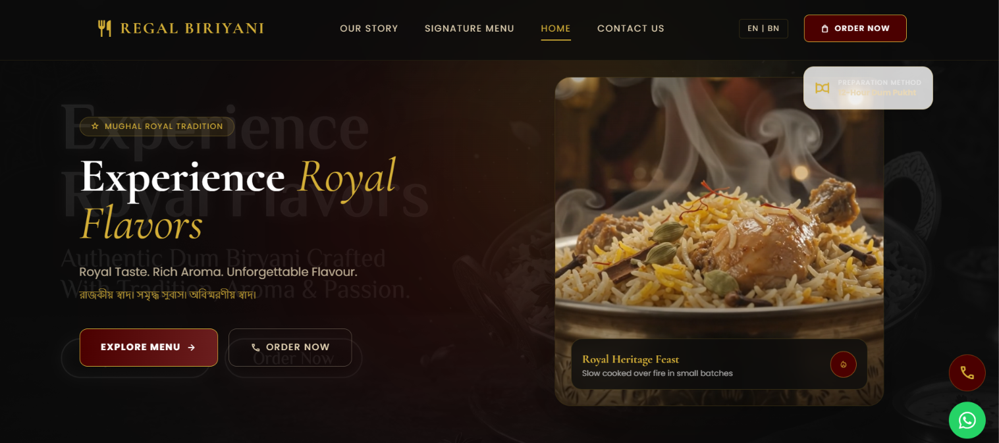

# 👑 Regal Biriyani (রিগ্যাল বিরিয়ানি)

<div align="center">

[](https://regal-biriyani.vercel.app/)
[](https://react.dev/)
[](https://vitejs.dev/)
[](https://tailwindcss.com/)
[](https://www.framer.com/motion/)
[](https://regal-biriyani.vercel.app/)

<p align="center">
  <strong>"Royal Taste. Rich Aroma. Unforgettable Flavour."</strong><br/>
  <em>A high-performance, cinematic web experience crafted for Regal Biriyani — celebrating authentic Awadhi & Kolkata Dum Pukht culinary heritage in Phulia, Nadia.</em>
</p>

[**🌐 Explore Live Application**](https://regal-biriyani.vercel.app/) • [**📱 WhatsApp Order**](https://wa.me/918514054004) • [**📍 Visit Us**](https://regal-biriyani.vercel.app/contact) • [**📑 View Menu**](https://regal-biriyani.vercel.app/menu)

</div>

---

## 📸 Landing Page Preview

<div align="center">
  <a href="https://regal-biriyani.vercel.app/" target="_blank" rel="noopener noreferrer">
    
  </a>
  <p align="center"><em>Live Hero Experience: Royal charcoal background, ambient particle glow, and 12-Hour Dum Pukht culinary showcase.</em></p>
</div>

---

## 📖 Table of Contents

- [Overview & Concept](#-overview--concept)
- [Key Features & Works](#-key-features--works)
- [Tech Stack](#-tech-stack)
- [Project Architecture & Folder Structure](#-project-architecture--folder-structure)
- [Application Routes](#-application-routes)
- [Local Development Setup](#-local-development-setup)
- [Design Aesthetics & Branding](#-design-aesthetics--branding)
- [Client & Credits](#-client--credits)

---

## 🍽️ Overview & Concept

**Regal Biriyani** is a client-commissioned web application engineered for an authentic Mughlai & Bengali restaurant based in **Phulia (Nadia, West Bengal)**. The goal of the project was to elevate the brand beyond a conventional restaurant website into a **luxurious, cinematic digital destination** that reflects the rich heritage of wood-fired handi cooking, 21 secret royal spices, and slow-dum basmati rice.

### Core Highlights:
- **Cinematic Dark Theme**: Deep charcoal black (`#0B0B0B`), imperial maroon (`#4B0000`), and royal gold (`#D4AF37`) palette.
- **Bilingual Experience**: Instant switching between **English** and **Bengali (বাংলা)** to cater seamlessly to local and regional patrons.
- **Frictionless Conversions**: Direct one-click WhatsApp order flows and phone dialers for high-velocity local ordering.
- **Complete Food Delivery Suite**: Live order tracking interface, order history ledger, and kitchen administration dashboard.

---

## ✨ Key Features & Works

### 1. 🌟 Hero Experience & Micro-Interactions
- **Parallax Background**: Atmospheric charcoal background layered with high-resolution food moodboards and soft radial embers.
- **Interactive Mouse Glow**: Dynamic radial torch effect following cursor movements (`MouseGlow.jsx`).
- **Floating Steam Particles**: Subtle animated particles simulating the warm steam rising from a freshly opened handi (`ParticleBackground.jsx`).
- **Smooth Inertial Scroll**: Powered by **Lenis** for a silky, premium browsing flow across desktop and mobile devices.

### 2. 🌐 Bilingual Localization (EN / BN)
- Integrated custom `LanguageContext` supporting dynamic translation strings for:
  - English (`en`)
  - Bengali (`বাংলা` - `bn`)
- Real-time language toggle in the header navigation preserving seamless UX without full page reloads.

### 3. 📜 Curated Digital Menu (`/menu`)
- Interactive categories: **All**, **Biryani**, **Starters**, **Quick Bites (Rolls & Momos)**, and **Drinks & Desserts**.
- Dish cards complete with:
  - High-res culinary photography
  - Bengali and English dish titles
  - Detailed recipe descriptions (saffron infusion, 21 spices, dum process)
  - Badges such as *Legendary*, *Classic*, *Royal Special*, and *Imperial Special*
  - Instant WhatsApp pre-order buttons

### 4. 🛵 Live Order Tracking Simulation (`/tracking`)
- Real-time delivery progress dashboard tracking order `#RB-8472-91`.
- Step-by-step milestone timeline:
  1. `Order Placed` (19:45)
  2. `Slow Cook Dum` (In Kitchen)
  3. `Handcrafted Packing`
  4. `Out for Delivery`
- Live countdown timer, estimated arrival window, delivery executive details, and mapped route indicator.

### 5. 👨‍🍳 Kitchen & Admin Order Management Portal (`/admin/orders`)
- Comprehensive back-of-house dashboard for floor managers:
  - Real-time active orders queue
  - Status updates (`Pending`, `Cooking`, `Dispatched`, `Delivered`)
  - Revenue analytics and kitchen volume counters
  - Quick action report generator and kitchen monitor links

### 6. 📊 Order History & Royal Financial Ledger (`/admin/ledger`)
- Customer order and financial accounting ledger:
  - Date filtering (`Last 30 Days`, `Last 3 Months`, `Year to Date`, `Custom Range`)
  - Status filters (`All Statuses`, `Delivered`, `Processing`, `Cancelled`)
  - Itemized breakdown of orders, quantities, payment modes, and royal invoices

### 7. 🏰 Brand Story & Heritage (`/about`)
- *"Our Heritage / আমাদের ঐতিহ্য"* storytelling page detailing the generational culinary journey from Mughal royal kitchens to the heart of Phulia & Santipur.
- Narrative on slow cooking over burning coals, pure saffron infusion, and commitment to fresh daily batches.

### 8. 🖼️ Visual Feast Gallery (`/gallery`)
- Masonry-style visual gallery displaying signature wood-fired handis, saffron preparation, chicken chaap, side delicacies, and dining atmosphere.

### 9. 📍 Location & Contact Section (`/contact`)
- Branch details for Phulia Bus Stand (near Handloom Market, Nadia).
- Visual location map pin, opening hours (11:00 AM – 10:30 PM), direct call CTA, and WhatsApp support.

---

## 🛠️ Tech Stack

| Layer | Technology | Description |
|---|---|---|
| **Framework** | [React 19](https://react.dev/) | Modern component architecture with concurrent features |
| **Bundler / Build** | [Vite 8](https://vitejs.dev/) | Ultra-fast Hot Module Replacement (HMR) and optimized build pipeline |
| **Styling** | [Tailwind CSS 3](https://tailwindcss.com/) | Custom design system tokens, royal color palette & utility-first classes |
| **Motion & Animations** | [Framer Motion 12](https://www.framer.com/motion/) | Page transitions (`AnimatePresence`), spring animations, and stagger effects |
| **Advanced FX** | [GSAP 3](https://greensock.com/gsap/) | High-performance timeline animations |
| **Smooth Scrolling** | [Lenis](https://lenis.darkroom.engineering/) | Inertial physics-based smooth scrolling |
| **Routing** | [React Router DOM 7](https://reactrouter.com/) | Declarative client-side routing |
| **State & Localization** | React Context API | Custom `LanguageContext` managing bilingual English/Bengali state |
| **Icons & Fonts** | Lucide React & Google Fonts | Cormorant Garamond, Poppins, Playfair Display, Material Symbols |
| **Hosting & CI/CD** | [Vercel](https://vercel.com/) | Automated Git continuous deployment, global CDN, and edge caching |

---

## 📂 Project Architecture & Folder Structure

```text
regal-biriyani-app/
├── dist/                          # Production build output (Vite output)
│   ├── assets/                    # Minified JS, CSS, and asset bundles
│   └── index.html                 # Optimized production HTML entry
│
├── public/                        # Static assets served directly
│   ├── favicon.svg                # Royal crest browser favicon
│   ├── icons.svg                  # SVG sprite icons
│   ├── git/                       # Repository assets & previews
│   │   ├── Landing page 1.png     # High-res landing page screenshot
│   │   └── landing-page.png       # Optimized README showcase image
│   ├── img/                       # Food photography & location assets
│   │   ├── borhani.png            # Traditional Borhani beverage
│   │   ├── chicken_chaap.png      # Awadhi Chicken Chaap
│   │   ├── restaurant_map.png     # Phulia location reference map
│   │   ├── saffron_infusion.png   # Pure Kashmiri Saffron graphic
│   │   └── shahi_tukda.png        # Shahi Tukda dessert
│   ├── new image/                 # Cinematic AI-generated culinary visual set
│   │   ├── Create_a_cinematic_hero_section_*.jpeg
│   │   ├── Cinematic_close-up_of_traditional_'Dum'_*.jpeg
│   │   └── only_keep_the_biriyani_and_*.jpeg
│   └── video/                     # Brand storytelling and hero video clips
│       ├── hero section.mp4
│       └── Our Story.mp4
│
├── src/                           # Application source code
│   ├── assets/                    # React internal SVG/asset files
│   │   ├── hero.png
│   │   ├── react.svg
│   │   └── vite.svg
│   │
│   ├── components/                # Modular reusable UI components
│   │   ├── Footer.jsx             # Royal footer with quick links, hours & legal
│   │   ├── Hero.jsx               # Hero section with CTA & preparation badges
│   │   ├── LocationSection.jsx    # Phulia branch map and store details
│   │   ├── MenuSection.jsx        # Homepage interactive menu preview
│   │   ├── MouseGlow.jsx          # Interactive mouse radial light effect
│   │   ├── Navbar.jsx             # Fixed blur navigation with EN/BN toggle
│   │   ├── ParticleBackground.jsx # Atmospheric steam/sparkle canvas particles
│   │   ├── SignatureDishes.jsx    # Featured signature handi cards
│   │   ├── SmoothScroll.jsx       # Lenis smooth scroll provider wrapper
│   │   ├── StorySection.jsx       # Homepage brand story teaser
│   │   └── Testimonials.jsx       # Customer reviews from Phulia community
│   │
│   ├── hooks/                     # Custom React hooks
│   │   ├── useGSAP.js             # GSAP lifecycle and selector hook
│   │   └── useLenis.js            # Smooth scroll initialization hook
│   │
│   ├── pages/                     # Full page route views
│   │   ├── About.jsx              # Heritage, values, and kitchen story
│   │   ├── AdminOrderManagement.jsx # Kitchen & floor order processing portal
│   │   ├── Contact.jsx            # Directions, opening hours & contact form
│   │   ├── Gallery.jsx            # High-definition food & handi photo gallery
│   │   ├── Home.jsx               # Main landing page combining all sections
│   │   ├── LiveOrderTracking.jsx  # Customer live order progress & route
│   │   ├── Menu.jsx               # Full filterable food & beverage catalog
│   │   └── OrderHistoryLedger.jsx # Customer and store transaction records
│   │
│   ├── App.css                    # Component-specific styles
│   ├── App.jsx                    # React Router configuration & AnimatePresence
│   ├── index.css                  # Tailwind directives and base styling
│   ├── LanguageContext.jsx        # Bilingual (EN/BN) dictionary & state provider
│   └── main.jsx                   # React root hydration entry point
│
├── .gitignore                     # Git ignored files & directories
├── index.html                     # HTML root template with Google Fonts
├── package.json                   # Project scripts and dependencies
├── postcss.config.js              # PostCSS plugins (Tailwind, Autoprefixer)
├── tailwind.config.js             # Custom royal color themes, fonts & spacing
└── vite.config.js                 # Vite build & plugin configurations
```

---

## 🗺️ Application Routes

| Path | Component | Description |
|---|---|---|
| `/` | `Home.jsx` | Main landing page featuring hero, signature dishes, story teaser & weekend offers |
| `/menu` | `Menu.jsx` | Full digital menu catalog with category filter and direct ordering |
| `/about` | `About.jsx` | Heritage narrative, culinary ethos, and wood-fired dum process |
| `/gallery` | `Gallery.jsx` | High-definition culinary and restaurant gallery |
| `/contact` | `Contact.jsx` | Phulia store branch address, interactive map, and inquiry form |
| `/tracking` | `LiveOrderTracking.jsx` | Real-time order status tracking with cooking & dispatch milestones |
| `/admin/orders` | `AdminOrderManagement.jsx` | Kitchen floor dashboard for order status tracking and reporting |
| `/admin/ledger` | `OrderHistoryLedger.jsx` | Historical order ledger with date filtering and payment receipts |

---

## 🚀 Local Development Setup

Follow these simple steps to clone and run the project locally on your machine:

### 1. Prerequisites
- **Node.js**: `v18.0.0` or higher ([Download Node.js](https://nodejs.org/))
- **npm** (comes with Node) or **yarn** / **pnpm**

### 2. Clone the Repository
```bash
git clone https://github.com/Suvam-paul145/regal-biriyani-app.git
cd regal-biriyani-app
```

### 3. Install Dependencies
```bash
npm install
```

### 4. Run Development Server
```bash
npm run dev
```
Open your browser and navigate to: `http://localhost:5173`

### 5. Build for Production
To generate an optimized, minified production build in the `dist/` directory:
```bash
npm run build
```

### 6. Preview Production Build
```bash
npm run preview
```

### 7. Run Code Quality Checks
```bash
npm run lint
```

---

## 🎨 Design Aesthetics & Branding

The design system was intentionally created to radiate luxury, royalty, and warmth:

- **Dominant Palette**:
  - `Brand Black`: `#0B0B0B` (Dark charcoal for deep contrast and cinematic ambience)
  - `Imperial Maroon`: `#4B0000` (Echoing Mughal royal carpets and slow handi flames)
  - `Royal Gold`: `#D4AF37` (Symbolizing Kashmiri saffron and pure brass cookware)
  - `Warm Cream`: `#E8D8B8` (Gentle readability on dark surfaces)
- **Typography Hierarchy**:
  - **Headings & Accents**: `Cormorant Garamond` (Classic royal serif) & `Playfair Display`
  - **Body & Controls**: `Poppins` & `Inter` (Crisp modern sans-serif for optimal readability)
- **Fluid Micro-Animations**:
  - Hover states on buttons with subtle golden glows (`boxShadow: 0 0 20px rgba(212, 175, 55, 0.4)`)
  - Smooth page transitions with Framer Motion `AnimatePresence`

---

## 👨‍💻 Client & Credits

- **Client**: **Regal Biriyani** (Phulia, Nadia, West Bengal)
- **Developed & Designed by**: [Suvam Paul](https://github.com/Suvam-paul145)
- **Live Deployment**: [https://regal-biriyani.vercel.app/](https://regal-biriyani.vercel.app/)
- **Repository**: [https://github.com/Suvam-paul145/regal-biriyani-app](https://github.com/Suvam-paul145/regal-biriyani-app)

---

<div align="center">
  <sub>Crafted with passion, saffron, and code by <strong>Suvam Paul</strong>. All rights reserved © 2024–2026 Regal Biriyani.</sub>
</div>
